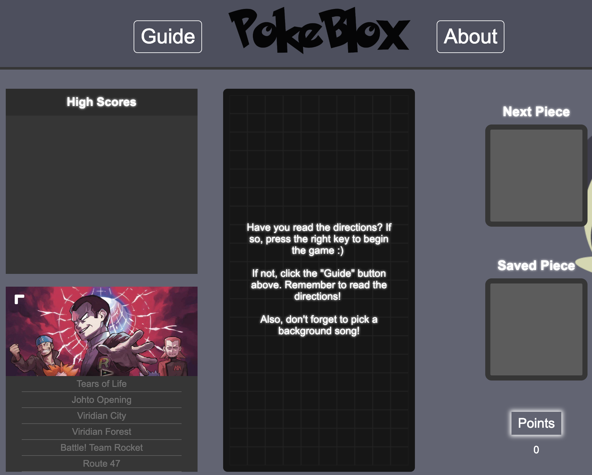

# PokéBlox 2.0: Two Popular Games Come Together in this Incredible Mash-Up

Live: http://www.loydkim.com/pokeblox2/



## Background and Overview
Tetris is a game that caught the world by storm and still continues to captivate the hearts of millions even today. Calling it a timeless classic is simply an understatement. It's a culture and, for some, a way of life.

The same can be said for Pokémon. Ever since its inception, it's captured the hearts of millions around the world. Over the course of time, Pokémon has become the world's leading media franchise, beating even the likes of Star Wars and Marvel.

Today, a new legend is born: PokéBlox. PokéBlox takes the classic game of Tetris and gives a Pokémon twist to it, combining two totally different worlds into one amazing experience. Feel priveleged as a game like this has never existed in the history of mankind.

Okay, fine. It's basically just Tetris with Pokémon graphics / music. But it's still fun to play! Be sure to read the directions before playing :)

## Rules
You can move pieces right, down, and left. You can also rotate pieces. If you fill up a whole row with piece colors, the row will clear, accrue points, and give you more room to add more pieces onto the board. The purpose of the game is to clear as many rows as possible without letting a piece hit the top of the board. Once the board fills up, you will lose the game.

## General Implementation
Each main part of the game (board, piece, shadow, play game) is its own class and contains its own instance methods.
All other important functionality such as DOM manipulation or piece objects are allocated into different JavaScript files to simplify file tree readability and to separate concerns.

Webpack is set up to make sure the game functions the way it is intended.

For styling, each part of the game is split into its own dedicated CSS file.

## Board Implementation
The entire board was created using a 10x20 array and HTML canvas. The canvas is of a fixed size: 300x600 pixels.

The board class has instance methods that allow it to generate a canvas board by iterating through a board array:

``` JavaScript
const canvasBoard = document.getElementById("board");
const context = canvasBoard.getContext("2d");

createEmptyBoard() {
  for (let y = 0; y < 20; y++) {
    this.board[y] = [];
    for (let x = 0; x < 10; x++) {
      this.board[y][x] = charcoal;
    }
  }
}

createGrid(x, y, blockColor, context) {
  if (x < 10 && y < 20) {
    const x_pos = x * 30;
    const y_pos = y * 30;
    context.fillStyle = blockColor;
    context.fillRect(x_pos, y_pos, 30, 30);
    context.strokeStyle = ash;
    context.strokeRect(x_pos, y_pos, 30, 30);
  }
}
  
drawBoard() {
  for ( let y = 0; y < this.board.length; y++ ) {
    for ( let x = 0; x < this.board[y].length; x++ ) {
      this.createGrid(x, y, this.board[y][x], this.context);
    }
  }
}
```
## Points Implementation
The board class contains an instance variable, *pointCounter*, which records how many rows were cleared for each piece drop. By using ths point counter, I'm able to use the following method to allow the player to accrue points as they clear rows:

``` JavaScript
handlePoints() {
  switch(this.pointCounter) {
    case 1:
      this.points += this.pointCounter * 10;
      document.getElementById("points").innerHTML = this.points;
      this.pointCounter = 0;
      break;
    case 2:
      this.points += (this.pointCounter * 20) + 10;
      document.getElementById("points").innerHTML = this.points;
      this.pointCounter = 0;
      break;
    case 3:
      this.points += (this.pointCounter * 30) + 20;
      document.getElementById("points").innerHTML = this.points;
      this.pointCounter = 0;
      break;
    case 4:
      this.points += (this.pointCounter * 40) + 30;
      document.getElementById("points").innerHTML = this.points;
      this.pointCounter = 0;
      break;
  }
}
```

## Piece Implementation
Each tetromino piece is an object that contains three properties:
1. Possible piece shapes (used for rotation)
2. Piece color
3. Piece type

JavaScript Example:
``` JavaScript
export const I = {
  shapes: [
    [ 
      [1, 1, 1, 1],
    ], 
    [
      [1], 
      [1], 
      [1], 
      [1],
    ]
  ],
  color: "rgb(168, 121, 255)",
  type: "I",
};
```

By using the three properties above, I am able to manipulate a piece in different ways. For example, in my piece rotation logic, I key into "shapes" and iterate through each piece matrix. If I want to render the piece's color on the canvas board, I simply key into "color", and if I want to detect the kind of piece I'm working with, I key into "type". This is extremely important because it allows me to predict the type of the next piece and display it accordingly. It also allows me to display a saved piece on the game screen.

Each piece contains *currentPiece*, *x_offset*, and *y_offset* instance variables. *currentPiece* is the currentPiece that we are keyed into in our tetromino object (in this case, the key would be "shapes"). x_offset and y_offset are the positions of the piece relative to the board. By using these three variables, I created the following logic to properly render pieces on the board:

``` JavaScript
drawPiece() {
  for (let y = 0; y < this.currentPiece.length; y++) {
    for (let x = 0; x < this.currentPiece[y].length; x++) {
      if (this.currentPiece[y][x] === 1) {
        this.createGrid(this.x_offset + x, this.y_offset + y, this.color, this.context);
      }
    }
  }
}
```

## Collision Detection
Because each piece is being rendered onto the board relative to its x and y positions, I used these positions to calculate whether there is a piece below or to the side of the piece. The following is a code snippet for vertical collision; horizontal collision contains similar logic:

``` JavaScript
if (this.y_offset >= 0) {
  for (let y = this.currentPiece.length - 1; y >= 0; y--) {
  for (let x = 0; x < this.currentPiece[y].length; x++) {
    if (this.currentPiece[y][x] === 1) {
      let gridBelow;
      if (this.y_offset + y + 1 < 20) gridBelow = this.board.board[this.y_offset + y + 1][this.x_offset + x];
      if (this.y_offset + y === 19) this.verticalCollision = true;
      else if (gridBelow !== charcoal) this.verticalCollision = true;
    }
   }
 }
}
```

## Shadow Piece
The shadow piece class is very similar to the piece class; however, it is different in that it is always rendered at the bottom-most possible part of the board. I do this by calling the *instantFall* method, which is called every time the piece is rendered on the board:

``` JavaScript
instantFall() {
  while (this.verticalCollision === false) {
    this.checkVerticalCollision();
    this.moveDown();
  }
}
```

## Gameplay Implementation
In order for the game to be playable, I use requestAnimationFrame, which recursively calls the *frameRate()* method. This method sets the frame rate for the game by calling the *moveDown* method of the piece class, which moves the piece down one grid. requestAnimationFrame allows the game to constantly call the *moveDown()* method, and this is what allows the piece to fall in the board. cancelAnimationFrame was used to pause and end the game.

Because requestAnimationFrame is relatively new, it isn't supported in all browsers, which is why I implemented the following code to make the game as accessible to as many browsers as possible:

``` JavaScript
const requestAnimationFrame = 
  window.requestAnimationFrame || 
  window.mozRequestAnimationFrame || 
  window.webkitRequestAnimationFrame || 
  window.msRequestAnimationFrame;
    
const cancelAnimationFrame = 
  window.cancelAnimationFrame || 
  window.mozCancelAnimationFrame;
```

Game start functionality was created using the following logic: 
``` JavaScript
if (this.currentPiece.verticalCollision === false) {
  this.currentPiece.moveDown();

  setTimeout(() => {
    if (this.toggleAnimation === true) this.animation = requestAnimationFrame(this.frameRate);
  }, 400);
}
```

Game over functionality was created using the following logic:
``` JavaScript
else {
  this.board.checkIfLose();
  if (this.board.gameOver === true) {
    cancelAnimationFrame(this.animation);
    this.start = false; // prevents the use of controls in piece_controls.js
    document.getElementById("game-over").play();
    return;
  }
  this.updateBoard();
  this.resetPiece();
  this.resetShadowPiece();
  this.frameRate();
}
```
